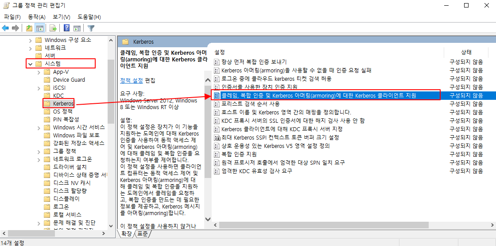

# Active Directory DAC 구성

Claim을 활용하여 동적으로 Access 권한을 제어하는 DAC에 대해 구성해보겠다. 

## Topolgy


## 부록

| Device Name | IP | Department information | User information |
| --- | --- | --- | --- |
| dc | 192.168.0.1/24 | Finance, HR | 이현준(Finance Department) 김종한(HR Department)
 |
| client | 192.168.0.100/24 | X | X |

## Senario

```powershell
dc는 skill.com의 Domain Controller로 작동한다.
Department Claim을 사용하여 DAC를 구성한다. 
DC의 C:\에는 Department의 이름과 같은 Folder가 존재하는데, Department와 Folder의 이름이 같아야지만 Access 할 수있는 설정을 할 것이다.
```

```powershell
빠른 진행을 위해 Active Directory는 구성이 되어 있는 상태라고 가정하겠다. 
```

---

## 1. DAC 기본 구성

먼저 **DAC Claim type**으로 **Department**를 사용할 것이기 때문에 해당 설정을 해주겠다. 

먼저 **Active Directory 관리 센터**로 진입한다.

```powershell
dsac.exe
```

동적 액세스 제어 → Claim Types → 우클릭 → 새로 만들기 → 클레임 유형


**Department Claim**을 선택해준다. 


Department Claim에서 제안 값을 클릭하여 기준으로 삼을 값을 지정해준다. 

- **여기 서는 Finance와 HR이 포함된다.**


위에서 생성한 Claim 유형을 가지고 Central Access Rules를 설정한다. 

```powershell
Central Access Rules 

중앙 액세스 규칙은 Device Claim, User Claim 등 Resource 속성과 관련된 하나 이상의 조건을 부여할 수 있는 규칙 식이다.

여러 Central Access Rules -> 단일 Central Access Polices
```

**동적 액세스 제어 → Central Access Rules → 새로 만들기 → 중앙 액세스 규칙**


중앙 액세스 규칙의 이름은 상관 없다. 

**다음 권한을 현재 권한으로 사용 클릭 → 편집**

```powershell
다음 권한을 현재 권한으로 사용 

이 설정은 Central Access Polices에서 이 정책이 포함된 상태로 설정되면 Resource에서 여기서 설정한 조건 식을 사용할 수 있다는 것이다.
```


**보안 주체 선택** 


[skill.com](http://skill.com) 에 있는 모든 Domain Users에 대한 Resource 접근 권한을 설정하기 때문에 Domain Users를 기준으로 설정한다.


**권한은 모든 권한이 부여된다.** 

하지만, 모든 권한이 부여되는 기준은 아래의 조건을 만족했을 때 부여되는 것이다. 

```powershell
조건 설명

아래의 조건은 ..

사용자의 Department가 값(문자열)으로 봤을 때 Finance 또는 HR과 일치하다면 조건이 충족

이 조건식들을 Central Access Polices에 포함하고 설정하면 Resource Access 접근 권한을 설정할 때 사용 가능하다.
```


위에서 Central Access Rules를 만들었다면 이걸 포함한 Central Access Policies를 구성하자. 

**동적 액세스 제어 → Central Access Policies →  새로 만들기 → 중앙 액세스 정책** 


구성원 중앙 액세스 규칙에 아까 생성했던 규칙을 추가한다. 

이름은 아무거나 상관없다.


---

## 2. Group Policy 정책 설정

**Claim을 지원하는 Group Policy를 설정한다.** 





그룹 정책 설정이 끝났으면 적용해준다.

### dc, client

```bash
gpupdate /force
```

---

## 3. File 권한 설정

**dc의 C:\share를 생성하고 C:\share\Finance와 C:\share\HR을 생성한다.** 

### Finance Folder

**우클릭 → 속성 → 보안 → 고급** 

!중요! 상속된 사용 권한을 제거한다. 

```bash
왜냐하면 C 드라이브의 권한을 상속받으면 Claim으로 분류하는 의미가 없어진다. 
```

**추가** 


**보안 주체 선택**


생성한 Claim을 가지고 적절히 조건을 수정한다. 

```bash
모든 권한 : 해당 아래 조건을 만족한다면 모든 조건을 부여한다.

조건 :  department가 Finance인 경우. 
```


### HR Folder도 똑같이 설정하면 된다.

---