# Active Directory FSMO 역할 이전 구성

아래와 같이 Topology를 구성한다. 

## Topology

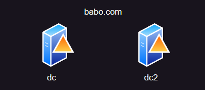


## 부록

| Device Name | IP Address  | FQDN |
| --- | --- | --- |
| dc | 192.168.0.1/24 | dc.babo.com |
| dc2 | 192.168.0.2/24 | dc2.babo.com |

## Senario

```powershell
1. Forest Root DC는 dc Device이다. 즉 처음에는 FSMO 5가지 역할이 모두 dc로 설정되어 있을 것이다.
2. dc2는 babo.com의 domain controller로 추가될 것이다. 
3. dc2는 dc의 역할 5가지를 모두 이전받을 것이다. 

빠른 진행을 위해 IP 및 Hostname은 변경되어 있는 상태이다. 
```

---

## 1. Active Directory 구성

먼저 Active Directory를 구성하기 위한 package를 설치해준다.

### dc, dc2

```powershell
Install-WindowsFeature ad-domain-services -IncludeManagementTools
```

먼저 dc에서 Forest Root Domain을 구성한다.

### dc

```powershell
Install-ADDSForest -DomainName babo.com
```

설치가 완료 되었다면 dc2를 [babo.com](http://babo.com) domain에 DC로 추가한다.

### dc2

```powershell
Install-ADDSDomainController -DomainName babo.com -Credential (Get-Credential babo\administrator) -SiteName Default-First-Site-Name -InstallDns:$true
```

## 2. FSMO 역할 확인 및 설정

dc에서 아래와 같은 Command를 입력해보자.

### dc

```powershell
netdom query fsmo
```

이렇게 5가지의 FSMO 역할이 현재 [dc.babo.com](http://dc.babo.com)으로 지정되어 있다는 것을 확인하였다. 

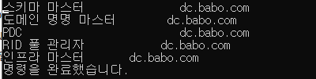


위의 역할 5가지를 dc2.babo.com으로 이전 해보도록 하겠다. 

여기서 사용할 방법은 두 가지 이다.

1. **GUI 방식**
2. **Ntdsutil 모듈 사용**

---

## 2-1. GUI 방식을 사용하여 FSMO 역할 이전

현재 Directory Server는 dc이며 변경할 Server인 dc2를 선택한다.

### dc

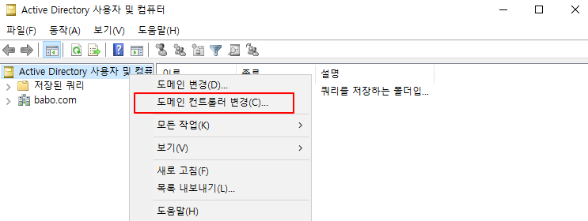


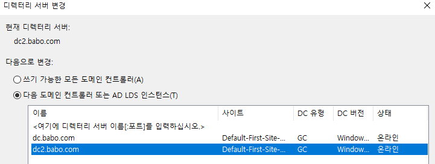


변경이 되었다면, 작업 마스터를 클릭한다. 

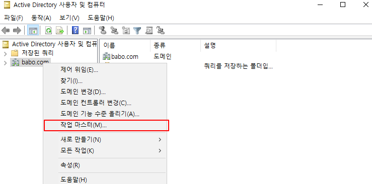


상단의 RID, PDC, 인프라 3개 모두 dc2 서버로 변경해준다.

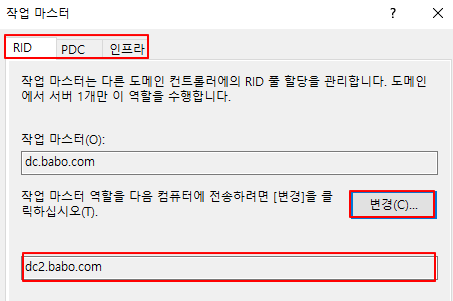


아래와 같이 다시 확인을 해보면 변경 했던 역할 3가지가 바뀐 것을 볼 수 있다. 

```powershell
netdom query fsmo
```

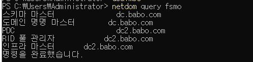


### 스키마 마스터 변경하는 방법

먼저 실행 창에서 **mmc**를 실행 시켜준다.

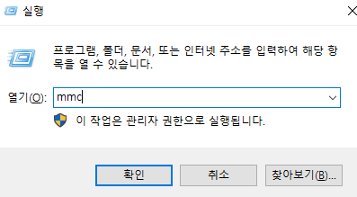

mmc → 파일 → 스냅인 추가/제거 

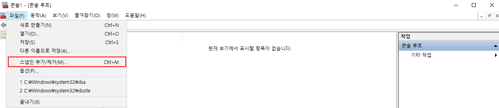


Active Directory 스키마 스냅인을 추가한다. 

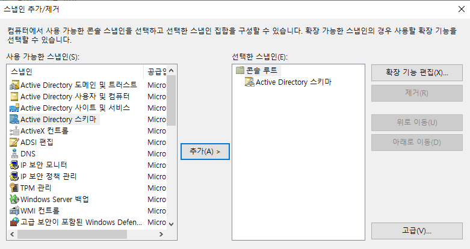


Active Directory 스키마에서도 똑같이 Domain Controller를 dc2로 변경한다. 

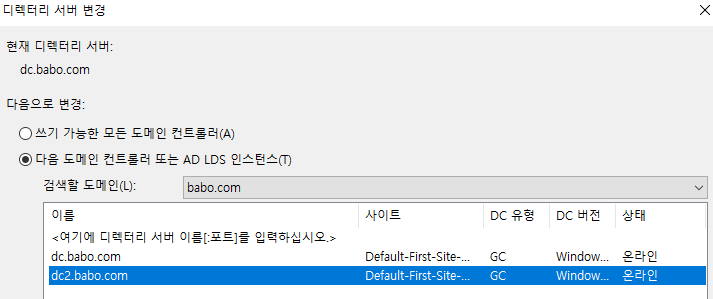

그 후 작업 마스터를 클릭하면 스키마 마스터도 GUI로 변경할 수 있다.

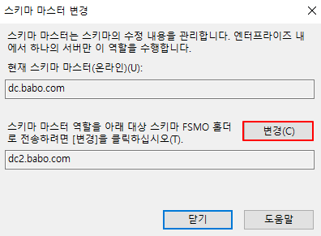

### 도메인 명명 마스터 변경하는 방법

먼저 아래 Command로 Active Directory 도메인 및 트러스트 Console 창으로 접속한다.

```powershell
domain.msc
```

여기서도 위랑 똑같이 Domain Controller 변경 후, 작업 마스터를 클릭한다. 

그럼 도메인 명명 마스터 역할도 GUI로 변경할 수 있다. 

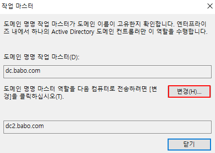


마지막으로 역할 전체를 확인해보면 ?

```powershell
netdom query fsmo
```

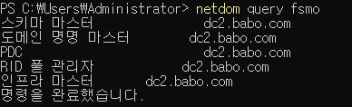


```powershell
만약 Active Directory Schema가 보이지 않는다면 cmd에서 아래와 같은 Command를 입력해주면 된다.

regsvr32 schmmgmt.dll
```

---

## 2-2. Ntdsutil로 역할 전이하기

dc2로 변경된 역할 5가지를 다시 dc로 돌려보겠다. 

이번에는 Ntdsutil이라는 Module를 사용해서 cmd 환경에서 CLI로 구성할 것이다. 

먼저 ntdsutil에 접속한다.

```powershell
C:\Users\Administrator>ntdsutil
ntdsutil:
```

역할에 관한 부분을 설정할 것이므로 roles를 입력해준다.

```powershell
ntdsutil: roles
fsmo maintenance:
```

dc Server로 역할을 전송할 것이기 때문에 dc로 연결한다. 

성공적으로 연결이 되었으면 quit으로 이전 창으로 빠져 나온다. 

```powershell
fsmo maintenance: connections
server connections: connect to server dc
dc2에 바인딩 중...
로컬에서 로그온된 사용자의 자격 증명을 사용하여 dc에 연결되었습니다.
server connections: quit
fsmo maintenance:
```

? 를 쳤을 때 나오는 `seize ~ dc` 명령어를 차례대로 입력해주면 ??

```powershell
fsmo maintenance: ?

 ?                             - 이 도움말 정보를 표시합니다.
 Connections                   - 특정 AD DC/LDS 인스턴스에 연결합니다.
 Help                          - 이 도움말 정보를 표시합니다.
 Quit                          - 이전 메뉴로 되돌아갑니다.
 Seize infrastructure master   - 연결된 서버의 구조 역할을 덮어씁니다.
 Seize naming master           - 연결된 서버의 명명 마스터 역할을 덮어씁니다.
 Seize PDC                     - 연결된 서버의 PDC 역할을 덮어씁니다.
 Seize RID master              - 연결된 서버의 RID 역할을 덮어씁니다.
 Seize schema master           - 연결된 서버의 스키마 역할을 덮어씁니다.
 Select operation target       - 사이트, 서버, 도메인, 역할 및 명명
```

```powershell
fsmo maintenance: Seize infrastructure master

fsmo maintenance: Seize naming master

fsmo maintenance: Seize PDC

fsmo maintenance: Seize RID Master

fsmo maintenance: Seize Schema master
```

그 후 다시 역할을 확인해보면 ??

```powershell
netdom query fsmo
```

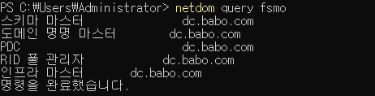


이렇게 Ntdsutil Module을 이용해서 FSMO 역할이 이전된 모습을 볼 수 있다.