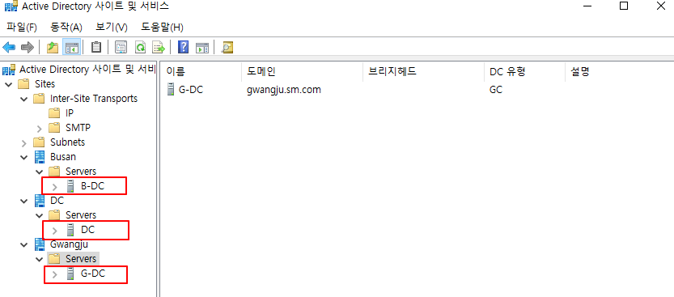

# Active Directory Site 구성 및 복제 

이번 Site 구성 실습에서는 이전과 다른 Topology로 구성을 할 것이다. 

```powershell
Site는 Subnet으로 구성 되기 때문에 각각 다른 네트워크에 Domain Controller들이 존재 하기 때문이다.
```

## Topology


### 부록

| Device Name | IP Address | User name  | Domain name |
| --- | --- | --- | --- |
| R | 1.1.1.2/30
2.2.2.2/30 |  |  |
| G-R | 1.1.1.1/30
192.168.0.254/24 |  |  |
| B-R | 2.2.2.1/30
192.168.1.254/24 |  |  |
| DC | 192.168.0.1/24 |  | sm.com |
| G-DC | 192.168.0.2/24 | 이현준 | gwangju.sm.com |
| G-Client | 192.168.0.100/24 |  |  |
| B-DC | 192.168.1.1/24 | 김종한 | busan.sm.com |
| B-Client | 192.168.1.100/24 |  |  |

### Senario

```powershell
1. DC가 Parent DC로 동작되고 G-DC와 B-DC는 Child DC로 동작한다.
2. GRE Tunneling을 통해 사설 대역끼리 통신을 할 수 있게 설정한다. 
(이 설정은 VPN을 다룰 때 자세히 알아보겠다.)
3. Active Directory에 User를 추가할 때 복제가 잘 이루어지는지 확인 해 볼것이다. 
4. 각 Client는 해당 네트워크 대역의 Domain Controller에 가입하여 동작 할 것이다.
```

### 고려할 사항

```powershell
빠른 작업을 위해 기본적인 구성 (hostname, Tunneling 등)은 되어 있다고 가정하겠다.
또한 Active Directory Domain 가입까지 모두 완료된 상황이라고 가정하겠다. User 까지 생성 완료 !!
```

---

## 1. Site 생성

### DC

먼저 각 네트워크 Subnet에 따른 Site를 생성하도록 하겠다. 

**192.168.0.0/24 - Gwangju**

**192.168.1.0/24 - Busan**

```powershell
New-ADReplicationSite -Name DC
New-ADReplicationSite -Name Gwangju
New-ADReplicationSite -Name Busan
# Gwangju, Busan, DC라는 이름의 Site를 생성 해주었다. 
```

아래의 Command를 입력하면 AD Site를 관리하는 Console 창으로 접속 할 수 있다.

```powershell
dssite.msc
# AD Site Management Console 접속
```

그럼 이렇게 아래와 같이 생성한 Site들을 확인해 볼 수 있다.


## 2. Subnet 생성

**Site**는 `Subnet을 기준으로 나누어진다.`

때문에, 해당 Site가 존재하는 Network 대역의 Subnet을 생성하고 **적절한 Site를 지정**한다.

```powershell
New-ADReplicationSubnet -Name "192.168.0.0/24" -Site Gwangju
New-ADReplicationSubnet -Name "192.168.1.0/24" -Site Busan
# 이렇게 Subnet을 생성하고 해당 Subnet에 존재하는 Site를 지정해준다.
```

**dssite.msc** 명령어를 통해 Console 창에 접속하면 …

아래와 같이 Subnet이 생성 되어 있으면서 Site가 잘 지정이 되어있는 것을 확인할 수 있다.


## 3. Site Link 생성

**Site 간의 통신을 정의**하고, **복제 및 동기화를 수행**하기 위해 `논리적인 통로`인 Link를 생성한다.

- 여기서 Link는 물리적인 Network를 반영하여 생성 한 것이다.

이론에서 설명했던 **KCC(Knowledge Consistency Checker)**는 Site Link 정보를 활용하여 AD의 구성을 참조하고 이에 따른 효율적인 Replication을 수행한다.

Gwangju - Busan 간의 Link를 생성하여 복제 및 동기화를 수행 할 수 있도록 설정하겠다.

```powershell
New-ADReplicationSiteLink -Name "Link" -SitesIncluded Gwangju,Busan,DC
# Site별로 연결되는 논리적인 통로인 Link를 생성함. 
```

**dssite.msc** 명령어를 사용하여 Link를 확인해 보면 …


Description과 Replication 간격은 Admin이 수동으로 관리할 수 있다. 

> 하지만 **Replication 간격**은 적절히 구성해야 한다.
> 
> 
> 그렇지 않으면 과도한 Traffic, 효율성을 떨어뜨릴 수 있다. 
> 

---

## 4. Server 이동

Domain Controller Server 들을 적절한 Site에 이동 시켜준다. 

**Busan —- B-DC / Gwangju —- G-DC / DC —— DC** 




Site를 확인하여 Server들이 잘 이동 되었는지 확인한다.

(Default-First-Site-Name은 삭제해도 상관없음.)

---

이제 이렇게 되면 각 DC들은 변경 사항이 생길 때마다 15분 단위로 복제를 진행 할 것이다. 

하지만 직접, 바로 지금 복제를 수동으로 하고 싶다면 ??

```powershell
repadmin /syncall /Aed

# 이 Command는 KCC Process를 즉시 실행시키는 Command이다. 
# 이 명령어를 수행할 시 바로 Site간 Replication을 수행한다.
```

(자세한 복제 확인은 Group Policy를 적용하면서 확인해 볼 것이다. )