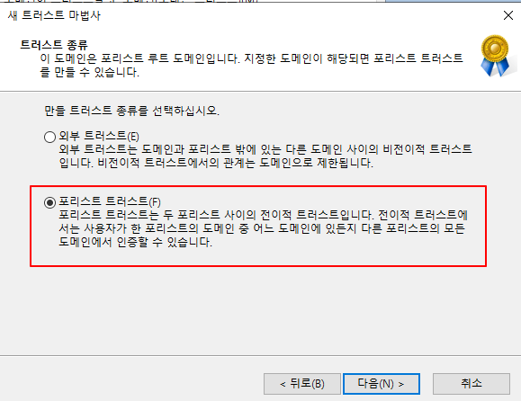
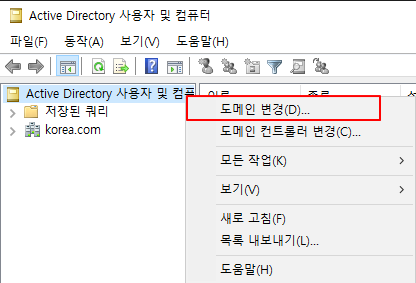
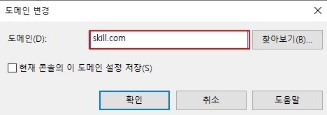

# Topology 2

기존에 설정했었던 [korea.com](http://korea.com) Forest와 Trust 관계를 맺는 실습을 해볼 것이다. 


Forest 간에 Trust 관계를 맺는 실습을 하기 위해 하나의 Forest 구조를 더 생성하였다.

- [Korea.com](http://Korea.com) - [Skill.com](http://Skill.com)

### 부가 설명

1. PDC2는 skill.com의 Parent DC이자 Forest Root DC이다.
2. Seoul DC와 Jeju DC는 skill.com의 Child DC이다. 
    - PDC2 : 192.168.0.4/24
    - Seoul DC : 192.168.0.5/24
    - Jeju DC : 192.168.0.6/24

## 1. VM 생성

- PDC와 Child DC들을 생성한다.
- 그 후, vmnet을 적절하게 설정한다.

### PDC2


### Seoul DC


### Jeju DC


---

## 2. IP 및 기타 설정

### PDC2 설정

**IP 설정을 먼저 해보겠다.**

`GUI 방식`

**ncpa.cpl**

DNS 주소가 192.168.0.4 (PDC2의 주소)인 이유는 위랑 마찬가지로 통합된 DNS 서비스를 구축하려고 하기 때문이다. 


`CLI 방식`

```powershell
1. IP를 넣어줄 Interface의 Alias 또는 Interface Index를 확인한다.
Get-NetAdapter 
Name                      InterfaceDescription                    ifIndex Status       MacAddress             LinkSpeed
----                      --------------------                    ------- ------       ----------             ---------
Ethernet0                 Intel(R) 82574L Gigabit Network Conn...       5 Up           00-0C-29-4C-35-63         1 Gbps

2. 해당 Interface에 IP를 할당한다. 
New-NetIPAddress -InterfaceAlias Ethernet0 -IPAddress 192.168.0.4 -PrefixLength 24
또는
New-NetIPAddress -InterfaceIndex 5 -IPAddress 192.168.0.4 -PrefixLength 24

3. DNS Server는 PDC2의 IP로 설정한다. 
Set-DnsClientServerAddress -InterfaceAlias ethernet0 -ServerAddresses 192.168.0.4
```

### Seoul DC 설정

`GUI 방식`

**ncpa.cpl**

DNS 주소가 192.168.0.4 (PDC2의 주소)인 이유는 위랑 마찬가지로 통합된 DNS 서비스를 구축하려고 하기 때문이다. 


`CLI 방식`

```powershell
1. IP를 넣어줄 Interface의 Alias 또는 Interface Index를 확인한다.
Get-NetAdapter 
Name                      InterfaceDescription                    ifIndex Status       MacAddress             LinkSpeed
----                      --------------------                    ------- ------       ----------             ---------
Ethernet0                 Intel(R) 82574L Gigabit Network Conn...       5 Up           00-0C-29-4C-35-63         1 Gbps

2. 해당 Interface에 IP를 할당한다. 
New-NetIPAddress -InterfaceAlias Ethernet0 -IPAddress 192.168.0.5 -PrefixLength 24
또는
New-NetIPAddress -InterfaceIndex 5 -IPAddress 192.168.0.5 -PrefixLength 24

3. DNS Server는 PDC2의 IP로 설정한다. 
Set-DnsClientServerAddress -InterfaceAlias ethernet0 -ServerAddresses 192.168.0.4
```

### JeJu DC 설정

`GUI 방식`

**ncpa.cpl**

DNS 주소가 192.168.0.4 (PDC2의 주소)인 이유는 위랑 마찬가지로 통합된 DNS 서비스를 구축하려고 하기 때문이다. 


`CLI 방식`

```powershell
1. IP를 넣어줄 Interface의 Alias 또는 Interface Index를 확인한다.
Get-NetAdapter 
Name                      InterfaceDescription                    ifIndex Status       MacAddress             LinkSpeed
----                      --------------------                    ------- ------       ----------             ---------
Ethernet0                 Intel(R) 82574L Gigabit Network Conn...       5 Up           00-0C-29-4C-35-63         1 Gbps

2. 해당 Interface에 IP를 할당한다. 
New-NetIPAddress -InterfaceAlias Ethernet0 -IPAddress 192.168.0.6 -PrefixLength 24
또는
New-NetIPAddress -InterfaceIndex 5 -IPAddress 192.168.0.6 -PrefixLength 24

3. DNS Server는 PDC2의 IP로 설정한다. 
Set-DnsClientServerAddress -InterfaceAlias ethernet0 -ServerAddresses 192.168.0.4
```

## 방화벽 설정

각 Device간에 통신이 원활하게 이루어지도록 방화벽 정책을 전부 풀어줄 것이다. 

- Host PC에서 이런 짓 하면 절대 안됩니다!

```powershell
New-NetFirewallRule -DisplayName any
```

## Hostname 설정

각 Device 별로 Hostname을 재 정의 해주자 

```powershell
PDC2 
Rename-Computer PDC2 -Restart

Seoul DC
Rename-Computer SeoulDC -Restart

Jeju DC
Rename-Computer JejuDC -Restart
```

---

## 3. ADDS 설치 및 구성

## 3. ADDS 설치 및 구성

**Parent DC**(Root DC)에 ADDS 역할을 설치한다. 

### PDC2

```powershell
Install-WindowsFeature ad-domain-services -IncludeManagementTools
# AD DS 서비스 설치 
Install-ADDSForest -DomainName skill.com [A]
# Active Directory의 Root Domain을 지정한다. 
```

### Seoul DC &  Jeju DC

**Child DC**로 구성해야 하므로 위 두 개의 Device에도 **AD DS** 역할을 설치하자.

```powershell
Seoul DC

Install-WindowsFeature ad-domain-services -IncludeManagementTools
# AD DS 서비스 설치 
Install-ADDSDomain -NewDomainName seoul -ParentDomainName skill.com -Credential (Get-Credential skill\administrator) -InstallDns:$False
# Child DC를 구성한다. Child DC의 이름은 busan이다. -> busan.korea.com
# Parent Domain은 Root Domain이기 때문에 korea.com이라고 지정해준다. 
# -InstallDns:$false 를 함으로써 Child DC에 DNS 역할을 설치 하지 않는다. (Parent DC를 통합 DNS Server로 사용하기 때문.)
# Credential을 korea\administrator로 지정함으로써 권한을 Parent Domain의 관리자로 자격을 증명한다. 

Jeju DC

Install-WindowsFeature ad-domain-services -IncludeManagementTools
# AD DS 서비스 설치 
Install-ADDSDomain -NewDomainName Jeju -ParentDomainName skill.com -Credential (Get-Credential skill\administrator) -InstallDns:$False
# Child DC를 구성한다. Child DC의 이름은 Gwangju이다. -> Gwangju.korea.com
# Parent Domain은 Root Domain이기 때문에 korea.com이라고 지정해준다. 
# -InstallDns:$false 를 함으로써 Child DC에 DNS 역할을 설치 하지 않는다. (Parent DC를 통합 DNS Server로 사용하기 때문.)
# Credential을 korea\administrator로 지정함으로써 권한을 Parent Domain의 관리자로 자격을 증명한다. 
```

- Child DC에서 `기타 사용자 →  Skill\administrator`로 Login하면 **Parent Domain**의 관리자 권한으로 로그인한다.

---

# 본격적인 Forest Trust 구성

2개의 Forest를 구성하였기 때문에 본격적으로 Forest Trust를 구성 해볼 것이다.


Forest간에 Trust 관계를 구성한다면 각 Trust의 속해있는 Domain들은 서로 다른 Forest의 Domain의 Resource를 이용할 수 있다. 

- 설정은 각 **Forest Root DC**에서 하면 된다.

## 1. 조건부 전달자 설정

### PDC

**dnsmgmt.msc**


**Trust**를 맺을 **Domain**과 **해당 Domain의 Root DC Server의 IP**를 적는다. 


**Properties**에서 잘 인식이 되고 있는지 확인한다! 

- 속성 → 편집


### PDC2

**dnsmgmt.msc**


위와 마찬가지로 **Trust**를 맺을 **Domain**과 **해당 Domain의 Root DC의 IP**를 적는다. 


**Properties**에서 잘 인식이 되고 있는지 확인한다! 

- 속성 → 편집


### 자 여기서, `조건부 전달자`는 왜 설정하는 것일까 ?

```markdown
조건부 전달자

 - 해당 Domain에 대한 Query는 해당 IP로 Query를 처리하라.

--- 

PDC Domain : korea.com 
PDC2 Domain : skill.com 

PDC 조건부 전달자 : skill.com - 192.168.0.4 
PDC2 조건부 전달자 : korea.com - 192.168.0.1 

즉, PDC에서 skill.com에 대한 Query는 전부 192.168.0.4로 Query를 전달해주는 것이다. 
마찬가지로, PDC2에서 korea.com에 대한 Query는 전부 192.168.0.1로 Query를 전달해주는 것이다.
```

---

## 2. Trust 설정

둘 중 하나의 Forest Root DC에서 **`domain.msc`**를 실행한다.

**domain.msc (PDC에서 설정하겠다.)**

### PDC


새 **Trust 관계를 맺기 위해 Trust 마법사**를 실행한다.


Trust를 맺을 Domain을 지정한다. 

- PDC의 Domain은 [korea.com](http://korea.com) 이다
- PDC2의 Domain인 skill.com과 Trust를 맺을 것이므로 **skill.com**이라고 지정한다.




**외부 트러스트**

- 외부 트러스트는 하나의 Domain과 Forest 밖에 있는 독립 적인 Domain과의 직접적인 Trust이다.
- 즉, 비전이적 Trust이다.
- 한마디로 `독립한 각각의 Domain이 수동으로 Trust 관계를 맺을 때 사용된다.`

**Forest Trust**

- Forest와 Forest 사이에서 맺어지는 계층 적인 Trust이다.
- 즉, 전이적 Trust이다.
- 한마디로 `Active Directory의 Forest간 맺어지는 Trust 관계이다.`


**양방향**

- 진짜 말 그대로 양방향이다.
- Trust가 맺어진 도메인 별로 서로 **Resource를 제공할 수 있고 사용할 수 있다.**

**단방향(받는 트러스트)**

- 이론에서 언급 했듯이, Trust와 Access는 서로 반대 방향이다.
- **받는 트러스트** 이므로 **Trust를 맺은 Domain의 Resource를 사용**할 수 있다.

**단방향(보내는 트러스트)**

- 받는 트러스트와 반대이다.
- **보내는 트러스트**로 선택하게 되면 **해당 도메인의 Resource를 제공**하는 것이다.


**이 도메인만**

- Local Domain에 대한 Trust 관계를 만든다.
- 즉, Local에서만 Trust를 만들기 때문에 지정한 도메인에서는 따로 Trust를 해줘야 한다.

**이 도메인과 지정한 도메인 모두**

- Local Domain과 지정한 도메인에서 서로 Trust 관계를 만든다.
- 하지만 지정한 도메인에 Trust를 만들 수 있는 **Admin** 권한이 있어야 한다.


아까 위에서 지정한 도메인 모두를 선택했기 때문에 **자격 증명 창**이 나오는 것임 !!


**전체 포리스트 인증**

- 지정된 Forest(skill.com)에 존재하는 모든 Domain 사용자는 Local Forest(korea.com)의 모든 Resource 또는 지정된 Resource에 접근할 수 있다.

**선택 인증**

- 지정된 Forest(skill.com)에 존재하는 특정 사용자만 Local Forest(korea.com)의 모든 Resource 또는 지정된 Resource에 접근할 수 있다.


**전체 포리스트 인증**

- Local Forest(korea.com)의 **모든 Domain 사용자**는 지정된 Forest(skill.com)의 모든 Resource 또는 지정된 Resource에 접근할 수 있다.

**선택 인증**

- Local Forest(korea.com)의 **특정 사용자**만 지정된 Forest(skill.com)의 모든 Resource 또는 지정된 Resource에 접근할 수 있다.

**Next ⇒ Next** 


Trust를 맺을 상대가 **만들어져 있기 때문에** 확인을 한다. 


이것도 마찬가지로 **이미 만들어져 있기 때문에** 확인한다.


위와 같이 **Trust 관계를 만들었다**는 변경 내용 상태를 볼 수 있다.


이렇게 Trust를 맺을 Forest와 **양방향**으로 Trust가 맺어져 있는 것을 볼 수 있다.

### PDC2

자 이제 PDC2에서도 확인해 봐야겠지 ?


이렇게 PDC2에서는 아무 설정을 하지 않았지만 이렇게 **양방향 Trust Forest**가 구성 되어있는 것을 볼 수 있다 !

---

## Trust 완성

자 이제 Forest간 Trust가 잘 맺어져 있는지 확인해볼까 ?

### PDC

`dsa.msc`

dsa.msc에서 Domain을 변경해서 Trust가 맺어져 있는 Forest의 Active Directory를 확인해보자 ! 







이렇게 Trust가 구성되어 있기 때문에 다른 Forest끼리도 공유가 되는 것이다 !!