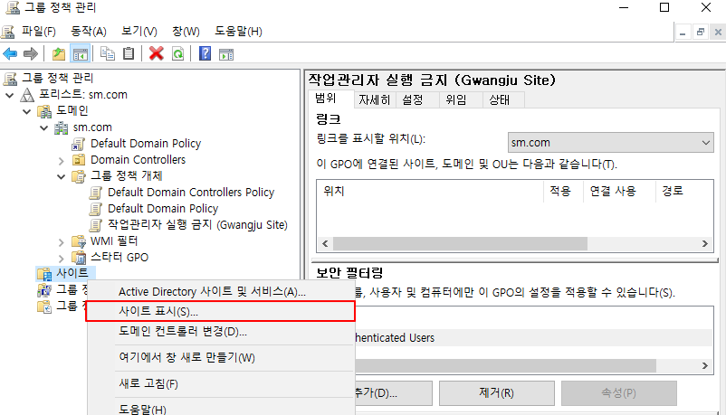

# 특정 AD Container Group Policy 적용

```powershell
1. Site
2. User
3. Domain
4. Computer
```

## 1. Site에 적용

일단 특정 Site에 적용하는 실습을 해보겠다. 

Site가 적용되어 있는 아래 Topology에서 실습 하도록 하겠다 .


```markdown
Site를 구성하는 실습 Document에서 Site 복제까지 구성하였기 때문에 바로 Group Policy 실습을 들어가겠다.
```

### Senario

```markdown
Gwangju Site = 작업관리자 실행 금지 
```

### DC

gpmc.msc 명령어를 활용해서 Group Policy Management Policy Console 창에 접속한다.

```markdown
gpmc.msc
```

먼저 Gwangju Site에 적용할 **GPO를 생성한다.**


이 GPO를 편집하겠다. 


이렇게 적절히 GPO를 편집 하였다면 Gwangju Site에 특정하게 적용해주도록 하겠다.

Site를 모두 표시해준다.




그 다음 Gwangju Site를 우클릭 하여 아까 생성한 GPO를 연결해준다.


그 후 Group Policy에 대한 정책이 변경되었기 때문에 바로 적용 시켜준다. 

```markdown
gpupdate /force 
```

또한 Gwangju Site에 변경 사항을 모든 DC와 동기화가 되어야 하므로 복제까지 수행한다.

```markdown
repadmin /syncall /Aed
```

## 확인 작업

G-Client에서 Gwangju Domain의 Administrator로 들어가서 **작업 관리자가 실행 되지 않는지** 확인한다.

### G-Client


아래처럼 작업 관리자는 **비 활성화** 된 것을 볼 수 있다.


B-Client에서 Busan Domain의 Administrator로 로그인 하여 **작업 관리자가 실행되는지** 확인한다.

### B-Client


아래처럼 작업 관리자는 **활성화** 되어 있는 것을 볼 수 있다.


---

## 2. User에 적용

### Senario

```markdown
DC Domain의 이현준 User = 제어판 실행 금지
 
# 이 유저는 존재하는 User이다. 
# Site Replication Topology에 User 부록을 참고하면 된다.
```

### DC

gpmc.msc 명령어를 활용해서 Group Policy Management Policy Console 창에 접속한다.

```markdown
gpmc.msc
```

먼저 Gwangju Site에 적용할 **GPO를 생성한다.**


이 GPO를 적절히 수정한다. 


이제 이 GPO에 대한 적용 범위를 이현준 User로 설정해준다. 

**먼저 Authentication User를 제거**해준다. 

**Authentication User**는 **Windows에서 인증된 사용자**를 뜻하기 때문에 제거해주어야 한다. 


그 후 **이현준 User**를 **보안 필터링에 추가**해준다.


그 후 **위임에  Authenticated Users를 추가**해준다. 

- 이유는 Authenticated Users를 해당 GPO에 대한 **읽기 권한**을 줘야 하기 때문이다.
- 읽기 권한 : GPO 설정 검토, GPO 설정 확인, GPO 설정 조회


그 후 이 GPO를 [sm.com](http://sm.com) Domain에 연결해준다. 


Group Policy에 변경 사항이 있었기 때문에 아래 Command를 입력해준다.

## DC, G-DC, B-DC

```powershell
gpupdate /force 
# Group Policy 정책 바로 적용

repadmin /syncall /Aed
# Active Directory 즉시 복제
```

이현준 User로 접속하여 Group Policy가 잘 적용 되었는지 확인한다. 


---

## 3. Domain 적용

[busan.sm.com](http://busan.sm.com) Domain의 User는 바탕 화면의 **휴지통 Icon이 보이지 않도록** 설정할 것이다.

시작하기 전, B-DC에 아래 Command를 활용하여 **김종한 User**를 생성하겠다.

```powershell
New-ADUser -Name "김종한" -AccountPassword (ConvertTo-SecureString "Skill39!@#" -AsPlainText -Force) -Enabled $true -Path "DC=busan,DC=sm,DC=com"
```

먼저, Group Policy Management Console에 접속한다.

```powershell
gpmc.msc
```

그 후, 모든 Domain을 표시해준다. 


[busan.sm.com](http://busan.sm.com) Domain에서 새로 적용할 Group Policy Object를 생성한다. 


위에서 생성한 GPO를 적절히 수정하겠다.


보안 필터링에는 Authentication Users만 있어도 된다. 

왜냐하면 인증된 사용자는 전부 User를 뜻하기 때문에 해당 Domain에 전체적으로 적용이 될 것이다.


Group Policy에 변경 사항이 있었기 때문에 아래와 같은 Command를 입력한다.

## DC, G-DC, B-DC

```powershell
gpupdate /force 
# Group Policy 정책 바로 적용

repadmin /syncall /Aed
# Active Directory 즉시 복제
```

그 후 Busan의 User인 김종한 User로 접속하여 휴지통 Icon이 없는지 확인해보자 !


---

## 4. Computer에 적용

**G-Client Computer에만 특정한 GPO**를 적용 시켜 보겠다.

**Logon 하였을 때 제목 123, 메시지 123을 띄우도록 하겠다.** 

먼저 G-client에게 적용할 GPO를 생성한다. 


생성한 GPO를 적절하게 수정하도록 하겠다. 


`이 GPO를 G-Client에만 적용을 시키는 설정을 하도록 하겠다.`

먼저 `보안 필터링`에 Authenticated Users를 삭제한 후, G-Client를 추가해준다.

그 후, `위임`에 Authenticated Users 읽기 권한을 부여한다. 


**추가 (개체 유형 → Computer Check)**


`Authenticated Users`에 **위임 권한 부여** 


그 후 [gwangju.sm.com](http://gwangju.sm.com) Domain에 해당 GPO를 연결해준다. 


Group Policy에 변경 사항이 있었기 때문에 아래와 같은 Command를 입력한다.

## DC, G-DC, B-DC

```powershell
gpupdate /force 
# Group Policy 정책 바로 적용

repadmin /syncall /Aed
# Active Directory 즉시 복제
```

### 확인

확인을 하기 위해 gwangju.sm.com에 가입한 Computer를 하나 더 추가하겠다. 

`G-Client123 추가`


```powershell
빠른 속도를 위해 G-Client123 Computer가 Domain 가입을 했다는 가정하에 진행하겠다.
```

Logon Message GP를 G-Client에만 적용을 시켰기 때문에 G-Client123은 같은 Domain 내에 있더라도 Logon Message가 뜨면 안된다. 

## G-Client


## G-Client123


이렇게 특정 Computer에 보안 필터링과 위임을 사용하여 GP를 제한할 수 있다. 

---

## 유의할 점 !!

### 1. 특정 User에 GP를 적용

이 설정은 Group Policy의 **사용자 정책**만 적용이 된다.

컴퓨터 정책은 User에 적용되지 않는다.


### 2. 특정 Computer에 GP를 적용

이 설정은 Group Policy의 **컴퓨터 정책**만 적용이 된다.

사용자 정책은 Computer에 적용되지 않는다.


