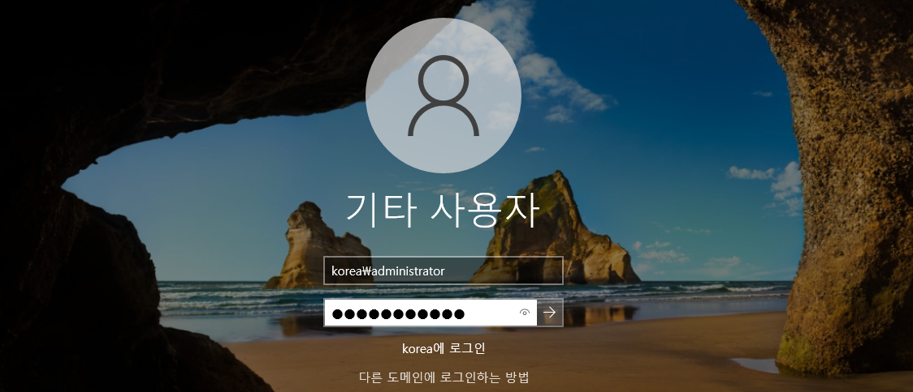

# Basic Active Directory 실습 

Windows Active Directory를 실습 해보자. 

### Topology


1. 하나의 Parent DC 를 가운데 둔다. 
2. Busan DC와 Gwangju DC를 **Child DC**로 삼는다.
3. Parent Domain은 `korea.com`이다. 
    - Parent DC IP : 192.168.0.1/24
    - Busan Child DC : 192.168.0.2/24
    - Gwangju Child DC : 192.168.0.3/24

```markdown
부가 설명 

위의 부모-자식 관계 DC는 하나의 Tree이자 하나의 Forest이다. 

Busan - Parent DC - Gwangju DC = vmnet0
```

---

## 1. VM 생성

- PDC와 Child DC들을 생성한다.
- 그 후, vmnet을 적절하게 설정한다.

### PDC


### Gwangju DC


### Busan DC


---

## 2. IP 및 기타 설정

### PDC IP 설정

`GUI 방식`

**ncpa.cpl**


`CLI 방식`

```powershell
# IP를 넣어줄 Interface의 Alias 또는 Interface Index를 확인한다.
Get-NetAdapter 
Name                      InterfaceDescription                    ifIndex Status       MacAddress             LinkSpeed
----                      --------------------                    ------- ------       ----------             ---------
Ethernet0                 Intel(R) 82574L Gigabit Network Conn...       5 Up           00-0C-29-4C-35-63         1 Gbps

# 해당 Interface에 IP를 할당한다. 
New-NetIPAddress -InterfaceAlias Ethernet0 -IPAddress 192.168.0.1 -PrefixLength 24
또는
New-NetIPAddress -InterfaceIndex 5 -IPAddress 192.168.0.1 -PrefixLength 24

# DNS Server는 PDC의 IP로 설정한다. 
Set-DnsClientServerAddress -InterfaceAlias ethernet0 -ServerAddresses 192.168.0.1
```

### Busan DC 설정

- DNS 주소가 Parent DC인 이유는 Parent Domain에 가입을 하면서 DNS Server를 Parent DC로 통합하려고 하기 때문이다.

`GUI 방식`

**ncpa.cpl**


`CLI 방식`

```powershell
# IP를 넣어줄 Interface의 Alias 또는 Interface Index를 확인한다.
Get-NetAdapter 
Name                      InterfaceDescription                    ifIndex Status       MacAddress             LinkSpeed
----                      --------------------                    ------- ------       ----------             ---------
Ethernet0                 Intel(R) 82574L Gigabit Network Conn...       5 Up           00-0C-29-4C-35-63         1 Gbps

# 해당 Interface에 IP를 할당한다. 
New-NetIPAddress -InterfaceAlias Ethernet0 -IPAddress 192.168.0.2 -PrefixLength 24
또는
New-NetIPAddress -InterfaceIndex 5 -IPAddress 192.168.0.2 -PrefixLength 24

# DNS Server는 PDC의 IP로 설정한다. 
Set-DnsClientServerAddress -InterfaceAlias ethernet0 -ServerAddresses 192.168.0.1
```

### Gwangju DC 설정

- DNS 주소가 Parent DC인 이유는 Parent Domain에 가입을 하면서 DNS Server를 Parent DC로 통합하려고 하기 때문이다.

`GUI 방식`

**ncpa.cpl**


`CLI 방식`

```powershell
# IP를 넣어줄 Interface의 Alias 또는 Interface Index를 확인한다.
Get-NetAdapter 
Name                      InterfaceDescription                    ifIndex Status       MacAddress             LinkSpeed
----                      --------------------                    ------- ------       ----------             ---------
Ethernet0                 Intel(R) 82574L Gigabit Network Conn...       5 Up           00-0C-29-4C-35-63         1 Gbps

# 해당 Interface에 IP를 할당한다. 
New-NetIPAddress -InterfaceAlias Ethernet0 -IPAddress 192.168.0.3 -PrefixLength 24
또는
New-NetIPAddress -InterfaceIndex 5 -IPAddress 192.168.0.3 -PrefixLength 24

# DNS Server는 PDC의 IP로 설정한다. 
Set-DnsClientServerAddress -InterfaceAlias ethernet0 -ServerAddresses 192.168.0.1
```

```powershell
중요 !! 
(Ping Test가 안된다면 ?)
New-NetFirewallRule -DisplayName any

# 해당 명령어로 모든 디바이스의 방화벽을 풀어줌으로써 원활하게 통신이 가능하도록 설정한다.
```

### 각 Device 별로 Hostname 재 정의

```powershell
PDC
Rename-Computer PDC -Restart

Busan DC
Rename-Computer BusanDC -Restart

Gwangju DC
Rename-Computer GwangjuDC -Restart
```

---

## 3. ADDS 설치 및 구성

**Parent DC**(Root DC)에 ADDS 역할을 설치한다. 

### PDC

```powershell
Install-WindowsFeature ad-domain-services -IncludeManagementTools
# AD DS 서비스 설치 
Install-ADDSForest -DomainName korea.com [A]
# Active Directory의 Root Domain을 지정한다. 
```

### BusanDC &  GwangjuDC

**Child DC**로 구성해야 하므로 위 두 개의 Device에도 **AD DS** 역할을 설치하자.

```powershell
Busan DC

Install-WindowsFeature ad-domain-services -IncludeManagementTools
# AD DS 서비스 설치 
Install-ADDSDomain -NewDomainName busan -ParentDomainName korea.com -Credential (Get-Credential korea\administrator) -InstallDns:$False
# Child DC를 구성한다. Child DC의 이름은 busan이다. -> busan.korea.com
# Parent Domain은 Root Domain이기 때문에 korea.com이라고 지정해준다. 
# -InstallDns:$false 를 함으로써 Child DC에 DNS 역할을 설치 하지 않는다. (Parent DC를 통합 DNS Server로 사용하기 때문.)
# Credential을 korea\administrator로 지정함으로써 권한을 Parent Domain의 관리자로 자격을 증명한다. 

Gwangju DC

Install-WindowsFeature ad-domain-services -IncludeManagementTools
# AD DS 서비스 설치 
Install-ADDSDomain -NewDomainName Gwangju -ParentDomainName korea.com -Credential (Get-Credential korea\administrator) -InstallDns:$False
# Child DC를 구성한다. Child DC의 이름은 Gwangju이다. -> Gwangju.korea.com
# Parent Domain은 Root Domain이기 때문에 korea.com이라고 지정해준다. 
# -InstallDns:$false 를 함으로써 Child DC에 DNS 역할을 설치 하지 않는다. (Parent DC를 통합 DNS Server로 사용하기 때문.)
# Credential을 korea\administrator로 지정함으로써 권한을 Parent Domain의 관리자로 자격을 증명한다. 
```

- Child DC에서 `기타 사용자 → Korea\administrator`로 Login하면 **Parent Domain**의 관리자 권한을 가진 상태로 Login 할 수 있다.





이렇게 되면 부모-자식 관계인 Active Directory 구조를 구성 한 것이다.  

아래와 같이 DNS도 PDC에서 **통합된 모습**을 볼 수 있다.


---
**설정이 완료되면 Parent DC는 Child DC의 Resource를,Child DC는 Parent DC의 Resource를 사용할 수 있다.**

- 즉 **양방향 Trust**가 형성이 되었다는 것이다.

```markdown
여기서 알 수 있는 점은 부모-자식 관계에서는 항상 자동으로 양방향 Trust 관계가 형성이 된다는것이다.
```
