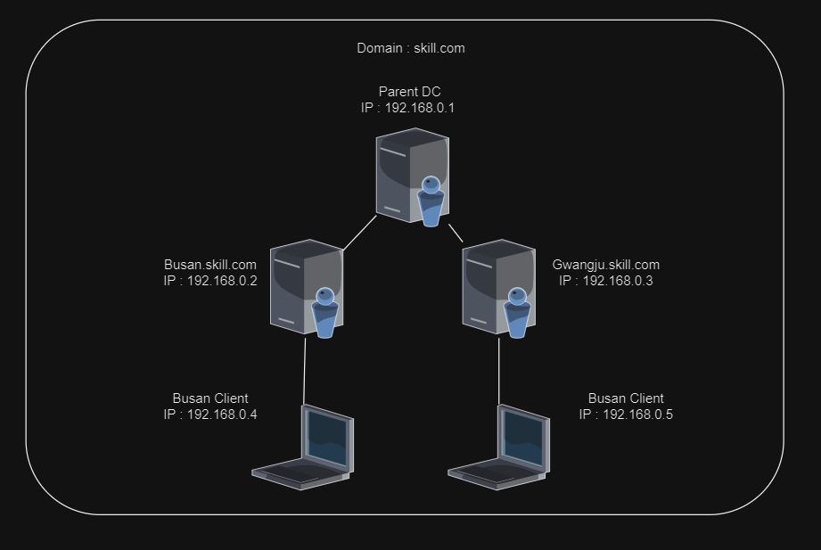
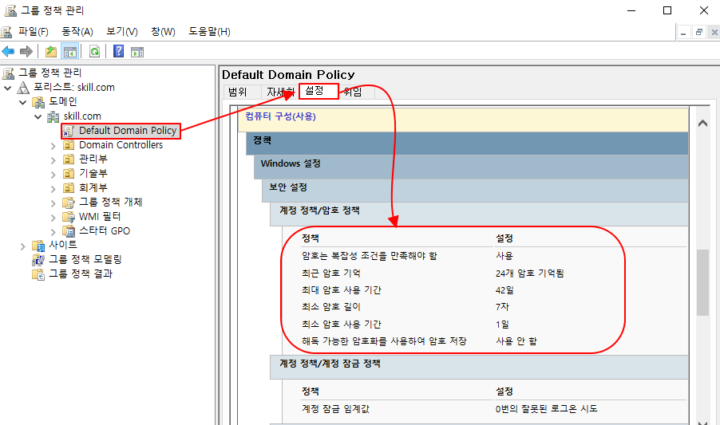
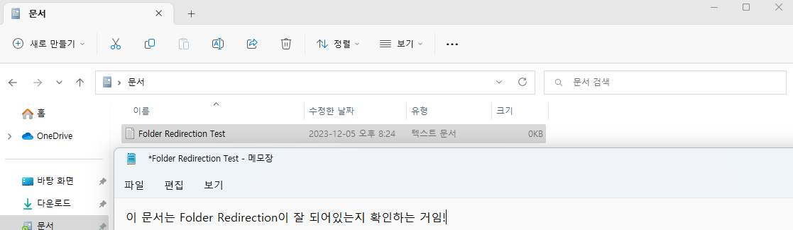

# Active Directory Group Policy

이 문서에서는 Group Policy에 대해 실습을 해보도록 하겠다.

## Topology




### 부록

**Parent DC Users and OU**

| OU | Users |
| --- | --- |
| 회계부 {회계 1팀, 회계 2팀} | 회계 1팀 : 이현준
회계 2팀 : 김종한 |
| 관리부 {관리 1팀, 관리 2팀} | 관리 1팀 : 신승호
관리 2팀 : 김예찬 |
| 기술부 {기술 1팀, 기술 2팀} | 기술 1팀 : 백송주
기술 2팀 : 김준서 |

(여기 문서에서는 각각 Active Directory 및 Domain 가입 등의 설정이 모두 되어 있는 상태라고 가정하고 진행 하겠다.)

---

## 1. OU 및 User 생성

Parent DC에 OU 및 User를 생성하겠다. 

### Create OU

```powershell
New-ADOrganizationalUnit -Name 회계부          # 회계부 OU 생성
New-ADOrganizationalUnit -Name 관리부          # 관리부 OU 생성
New-ADOrganizationalUnit -Name 기술부          # 기술부 OU 생성 

New-ADOrganizationalUnit -Name "회계 1팀" -Path "OU=회계부,DC=skill,DC=com"     # 회계 1팀 OU를 회계부 OU 하위에 생성
New-ADOrganizationalUnit -Name "회계 2팀" -Path "OU=회계부,DC=skill,DC=com"     # 회계 2팀 OU를 회계부 OU 하위에 생성
New-ADOrganizationalUnit -Name "관리 1팀" -Path "OU=관리부,DC=skill,DC=com"     # 관리 1팀 OU를 관리부 OU 하위에 생성
New-ADOrganizationalUnit -Name "관리 2팀" -Path "OU=관리부,DC=skill,DC=com"     # 관리 2팀 OU를 관리부 OU 하위에 생성
New-ADOrganizationalUnit -Name "기술 1팀" -Path "OU=기술부,DC=skill,DC=com"     # 기술 1팀 OU를 기술부 OU 하위에 생성
New-ADOrganizationalUnit -Name "기술 2팀" -Path "OU=기술부,DC=skill,DC=com"     # 기술 2팀 OU를 기술부 OU 하위에 생성
```

### Create User

```powershell
New-ADUser -Name 이현준 -AccountPassword (ConvertTo-SecureString "Skill39!@#" -AsPlainText -Force ) -DisplayName 이현준 -Path "OU=회계 1팀,OU=회계부,DC=skill,DC=com" -Enabled $true
New-ADUser -Name 김종한 -AccountPassword (ConvertTo-SecureString "Skill39!@#" -AsPlainText -Force ) -DisplayName 김종한 -Path "OU=회계 2팀,OU=회계부,DC=skill,DC=com" -Enabled $true
New-ADUser -Name 신승호 -AccountPassword (ConvertTo-SecureString "Skill39!@#" -AsPlainText -Force ) -DisplayName 신승호 -Path "OU=관리 1팀,OU=관리부,DC=skill,DC=com" -Enabled $true
New-ADUser -Name 김예찬 -AccountPassword (ConvertTo-SecureString "Skill39!@#" -AsPlainText -Force ) -DisplayName 김예찬 -Path "OU=관리 2팀,OU=관리부,DC=skill,DC=com" -Enabled $true
New-ADUser -Name 백송주 -AccountPassword (ConvertTo-SecureString "Skill39!@#" -AsPlainText -Force ) -DisplayName 백송주 -Path "OU=기술 1팀,OU=기술부,DC=skill,DC=com" -Enabled $true
New-ADUser -Name 김준서 -AccountPassword (ConvertTo-SecureString "Skill39!@#" -AsPlainText -Force ) -DisplayName 김준서 -Path "OU=기술 2팀,OU=기술부,DC=skill,DC=com" -Enabled $true
```

---

## 2. 기본적인 Group Policy 실습

### Senario

```markdown
Domain 사용자를 생성할 때 암호와 관련된 Group Policy가 기본적으로 어떻게 설정되었는지 확인하자.

Active Directory Container의 User를 생성할 때 복잡한 Password를 요구한다. 
skill.com의 모든 Domain 내의 모든 개체들은 이 정책을 무시하고 간단한 Password를 사용하여 User를 생성할 수 있게 한다. 
```

### Group Policy를 설정하기 전

Active Directory 내의 User를 생성할 때는 기본적으로 Windows에서 복잡한 Password를 요구한다. 

그렇기 때문에 아래와 같이 User가 생성되지 않는 것이다.

```powershell
New-ADUser -Name 홀란드 -AccountPassword (ConvertTo-SecureString "password" -AsPlainText -Force) -DisplayName 홀란드 -Path "DC=skill,DC=com"
```


### Group Policy를 설정한 후

 Domain에 기본으로 적용되어 있는 GP인 **Default Domain Policy** 확인하고 변경한다.

1. **Group Policy Management Console을 접속한다.** 

```powershell
gpmc.msc
```




Default Domain Policy의 암호 정책의 기본 설정은 **복잡성 조건을 만족**해야 한다고 설정 되어있다.

이 설정을 사용하지 않음으로 설정한다면 암호는 간단한 암호로도 User를 생성할 수 있을 것이다. 

1. **Default Domain Policy 편집**

`오른쪽 클릭 → 편집(E)`


Group Policy를 바로 적용 시켜주기 위해 아래와 같은 명령어를 입력해준다.

```powershell
gpupdate /force   
```

그 후, 다시 똑같은 Password로 User를 생성해보자. 오류 없이 잘 생성된 것을 확인할 수 있다.

```powershell
New-ADUser -Name 홀란드 -AccountPassword (ConvertTo-SecureString "password" -AsPlainText -Force) -DisplayName 홀란드 -Path "DC=skill,DC=com" -Enable $true
```


---

## 2-1. 기본적인 Group Policy 실습 2

### Senario

```markdown
회계부 OU 사용자들이 [제어판]을 사용하지 못하도록 Group Policy를 만들고 적용하자.
```

**회계부**에는 아래와 같이 User들이 생성 되어 있을 것이다.


### 1. **회계부 OU에 대한 GPO를 생성한다.**

- 특정 Active Directory Container에만 적용 시키기 위한 설정이다.
- 그룹 정책 개체 → 우클릭 → 새로 만들기(N)


### 2.  `제어판 제한 정책` 설정 편집

- 추가한 GPO를 적절히 수정한다.


### 3. **이 GPO를 적용할 범위를 지정한다.**

- 이 시나리오에서는 회계부 OU에 적용할 것 이다.
- 회계부 우클릭 → 기존 GPO 연결


Group Policy를 바로 적용 시켜주기 위해 아래와 같은 명령어를 입력해준다.

```powershell
gpupdate /force   
```

> 생성한 Group Policy는 **C:\Windows\SYSVOL\sysvol\Domain name\Policies** 에 저장된다.
> 


### 4. **Client에서 Domain 사용자인 회계부 OU의 이현준(이현준\Skill)으로 로그온해서 Group Policy가 잘 적용되었는지 확인한다.**


이렇게 아래와 같이 제어판이 제한 되어 있는 것을 확인할 수 있다. 

---

## 3. 상속 실습

### Senario

```markdown
현재 회계 OU에 제어판 제한 Group Policy가 적용 되어 있는 상태이다.

회계 2팀에 **상속을 차단**함으로써 2팀에 속해있는 User는 해당 Group Policy가 적용되지 않는 설정을 한다.
```

### 1. **회계 2팀에 `제어판 제한 정책` Group Policy 상속을 차단한다.**


### 2. **Group Policy를 바로바로 적용 시키기 위해 아래 Command를 입력한다.**

```powershell
gpupdate /force 
```

### 3. **자, 이제 상속이 제대로 차단이 되었는지 확인해보겠다.**

- 회계 1팀의 User인 **이현준** User로 로그인한다.
- Login 한 후, 제어판이 열리지 않는지 확인한다.


- 그 후 회계 2팀의 User인 김종한 User로 로그인한다.
- Login 한 후, 제어판이 열리는지 확인한다.

아래와 같이 정상적으로 잘 열리는 것이 확인된다.


이렇게 상속을 차단함으로써 하위 OU에 상위 OU에 적용 되어 있는 Group Policy를 적용 시키지 않을 수 있다. 

---

## 4. Group Policy Backup and Recovery

이번엔 Group Policy를 Backup 하고 Recovery를 해보겠다.

### Backup와 Recovery가 필요한 이유는 ?

우리는 미래를 알지 못한다. 설정해 놓은 GPO가 어느 순간 전부 삭제가 될 수 있는 것이다. 

그렇기 때문에 GPO를 따로 저장 (Backup)을 하고 Backup한 GPO를 가지고 복구(Recovery)할 수 있게 설정을 해 놓는 것이 좋다.

## Backup 실습

### 1. Group Policy Objects Backup

위에서 설정한 제어판 제한 정책 GPO를 backup 해보겠다.


### 2. GPO를 Backup할 경로와 설명을 적어준다.

설명은 Option으로 꼭 필요한 건 아니다. 

`위치에 적어준 경로는 실제로 존재해야하는 경로이므로 C:\Backup을 생성하고 진행한다.`


## Recovery 실습

C:\Backup 폴더에 GPO를 Backup 하였으므로 Backup 한 GPO를 가지고 Recovery를 해보겠다.

### 1. GPO 삭제

먼저 복구할 GPO를 삭제하겠다.


### 2. GPO Recovery

빈 곳을 우클릭하여 백업을 진행한다.


아래와 같이 복구할 GPO를 선택하여 아래 [복원] Button을 누르면 GPO가 복원이 된다.


이렇게 혹시 모를 상황을 대비하여 GPO를 Backup을 하고 Recovery를 할 수 있다. 

---

## 5. Folder Redirection Group Policy

대표적으로 Group Policy에서 사용되는 Option 중 하나 이다. 

### Folder Redirection 이란?

```powershell
Domain의 사용자가 Domain 내의 어떤 Computer에서 접속하든지 자신이 사용하던 폴더 (주로 내 문서)가 그대로 보이도록 하는 것이다.
그렇게 되면 User는 어느 Computer에서 접속하든지 자신의 Computer로 착각하는 효과를 낼 수 있다.

# 고려해야 할 점 
1. Domain User의 Folder는 Domain server에 저장된다. 그러므로 Server의 부하를 고려해야 한다.
2. 용량이 큰 파일은 바람직하지 않다. 
3. Folder Redirection이 가능한 항목은 내문서/Application Data/바탕화면/시작메뉴 등이 있다.
```

### Senario

```powershell
관리부의 User들은 내 문서를 C:\DomainUserUsed로 Redirection 되야한다.
```

### 1. Domain User가 사용할 Folder를 생성하고 공유한다.

Domain User가 Redirection 할 때 사용할 Folder를 생성한다. 

- 우선, **C:\DomainUserUsed** Folder를 생성한다.


- 그 후 해당 Folder는 **DomainUserUsed$**로 숨김 공유 시킨다.
- 또한, 보안성을 위해 Authentication Users에게만 모든 권한을 준다
    - Authentication Users 자격을 얻을 수 있는 user들은 **Windows Server에서 생성한 모든 사용자**가 해당된다.
    - Folder 우클릭 → 속성 → 공유 → 고급 공유
    
   


### 2. Folder Redirection GPO 생성 및 편집

그룹 정책 개체를 우클릭하여 생성을 한다.  이름은 적절히 **Folder Redirection Policy**로 정해준다.


그 후 위 GPO를 적절히 편집한다. 

**문서 → 속성** 


```powershell
이렇게 설정되면 아까 생성 및 공유했던 Folder 하위에 내 문서가 Redirection 되는 것이다.
```

### 3. GPO 연결

관리부 OU에 Folder Redirection Policy를 연결한다. 


### 4. gpupdate /force

변경된 Group Policy가 바로 적용되도록 **gpupdate /force** Command를 입력해준다.

```powershell
gpupdate /force
```

### 5. Folder Redirection 확인

관리부 OU의 User인 신승호 User로 로그인 하여 확인해보겠다. 

아래와 같이 음악은 **Folder Redirection이 되어 있지 않으므로** 경로가 **C:\Users\신승호** 인것을 볼 수 있다.


하지만 문서는 Folder Redirection의 속성을 확인해보면 경로가 공유된 Server의 Folder임을 확인할 수 있다. 


**Busan Client**에서 신승호 User로 로그인 하여 문서에 아무 Text File을 생성해보겠다.




이제 **Gwangju Client**에서 신승호 user로 Login 하여 문서로 들어가 보겠다.

이렇게 아래와 같이 Text 파일을 확인할 수 있었다.


### 6. Folder Redirection folder 확인

Folder Redirection Folder를 확인해보겠다.


이렇게 확인해보면 Folder 안에 로그인한 user의 문서 폴더를 확인할 수 있다. 

```powershell
하지만, 문서 폴더를 Click 하면 접근은 거부될 것이다.
비록 Administrator 권한의 사용자도 공유된 Domain User의 Folder에는 접근할 수 없다.
```

이렇게 같은 Domain 내의 User로 어느 Computer에서 Login 하든지 상관없이 자신이 작업하던 환경을 그대로 제공 받을 수 있는 역할을 하는 것이 Folder Redirection 이다. 

---